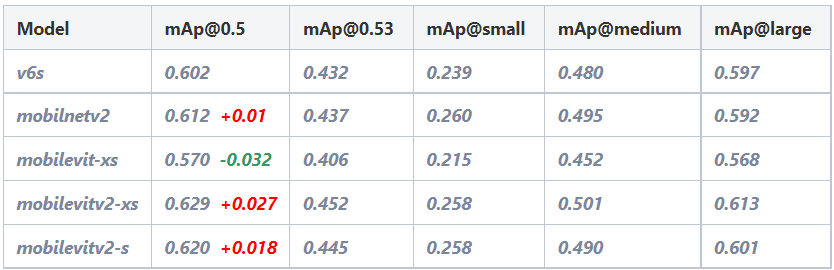
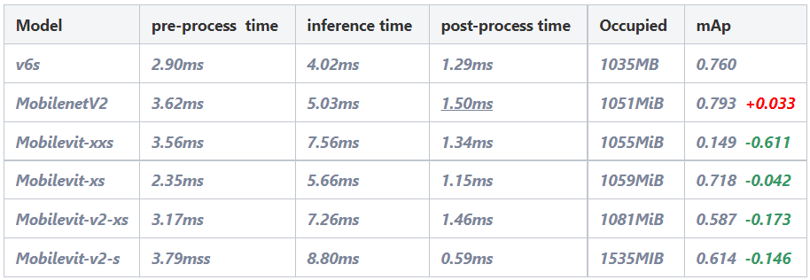

# Mobile && Anchor-free

## 简介
本项目基于Yolov6和Mobilevit架构\
在此感谢两位作者(https://github.com/meituan/YOLOv6)和(https://github.com/apple/ml-cvnets)\
将Transformer模型的mobilenet网络连接到Yolov6模型的anchor-free的头部网络\
期望将Yolov6的backbone 部分的'Repvgg'替换成'MobileNet'和'Mobilevit'等小模型，以提高精度和推理速度.

### 环境配置
详细环境配置在requirements.txt中，按如下:
```shell
pip install -r requirements.txt
```
### 训练模块

单GPU训练
```shell
python tools/train.py --batch 32 --conf configs/yolov6s.py --data data/coco.yaml --device 0
```
多GPU训练(需要使用DDP模块)
```shell
python -m torch.distributed.launch --nproc_per_node 8 tools/train.py --batch 256 --conf configs/yolov6s.py --data data/coco.yaml --device 0,1,2,3,4,5,6,7
```

<details>
<summary>基于COCO数据集实现</summary>

对于 nano 模型
```shell
python -m torch.distributed.launch --nproc_per_node 4 tools/train.py \
									--batch 128 \
									--conf configs/yolov6n.py \
									--data data/coco.yaml \
									--epoch 300 \
									--device 0,1,2,3 \
									--name yolov6n_coco
```

对于 small/tiny 模型
```shell
python -m torch.distributed.launch --nproc_per_node 8 tools/train.py \
									--batch 256 \
									--conf configs/yolov6s.py \ # configs/yolov6t.py
									--data data/coco.yaml \
									--epoch 400 \
									--device 0,1,2,3,4,5,6,7 \
									--name yolov6s_coco # yolov6t_coco
```

对于 mobilenetv1/v2/vit/vitv2 模型
``` shell
python -m torch.distributed.launch --nproc_per_node 8 tools/trian.py \
                  --batch 256 \
                  --conf configs/yolov6s_mobile.py  \ # configs/yolov6s_mobilev2.py # configs/yolov6s_mobilevit_xxs.py 
                  --data data/coco.yaml \
                  --epoch 400 \
                  --device 0,1,2,3,4,5,6,7 \
                  --name yolov6s_mobilev1_coco # yolov6s_mobilev2_coco # yolov6s_mobilevit_coco
```

对于 medium/large 模型
```shell
# Step 1: 训练一个预训练模型
python -m torch.distributed.launch --nproc_per_node 8 tools/train.py \
									--batch 256 \
									--conf configs/yolov6m.py \ # configs/yolov6l.py
									--data data/coco.yaml \
									--epoch 300 \
									--device 0,1,2,3,4,5,6,7 \
									--name yolov6m_coco # yolov6l_coco
									
                                                                                      
# Step 2: 进行自蒸馏训练
python -m torch.distributed.launch --nproc_per_node 8 tools/train.py \
									--batch 256 \ # 128 for distillation of yolov6l 
									--conf configs/yolov6m.py \ # configs/yolov6l.py
									--data data/coco.yaml \
									--epoch 300 \
									--device 0,1,2,3,4,5,6,7 \
									--distill \
									--pretrain_model_path runs/train/yolov6m_coco/weights/best_ckpt.pt \ # # yolov6l_coco
									--name yolov6m_coco # yolov6l_coco
```
</details>

- 配置文件:选择配置文件进行训练，或者配置需要的文件对特殊的网络/权重/超参数
- 数据文件:可以选择使用COCO数据库(http://cocodataset.org)并配置labels文件(https://github.com/meituan/YOLOv6/releases/download/0.1.0/coco2017labels.zip)，\
或者对于其他训练集，可以在data.yaml中修改路径
- 确保数据保存格式如下:
```
├── coco
│   ├── annotations
│   │   ├── instances_train2017.json
│   │   └── instances_val2017.json
│   ├── images
│   │   ├── train2017
│   │   └── val2017
│   ├── labels
│   │   ├── train2017
│   │   ├── val2017
│   ├── LICENSE
│   ├── README.txt
```
<details>
<summary>重新加载训练</summary>
如果训练进程被意外中断，可以参照如下步骤重新加载训练
```shell
# multi GPU training.
python -m torch.distributed.launch --nproc_per_node 8 tools/train.py --resume
```
也可以选择一个指定路径来重新加载训练
```shell
# 将 /path/to/your/checkpoint/path 替换成所需重新训练的文件路径即可.
--resume /path/to/your/checkpoint/path
```
</details>

### 测试模块
对于 yolov6 和 mobilenet 模型
``` shell
python tools/eval.py --weights yolov6s.pt --data data/coco.yaml --device 0 --batch-size 32
```
对于 mobilevit 模型需要调整输入图片大小将其固定在(640,640)
``` shell
python tools/eval.py --preprocess_img --weigths yolov6s_mobilevit_xxs.pt --data data/coco.yaml --device 0 --batch-size 32
```

### 推理模块

对于 yolov6 和 mobilenet 模型
``` shell
python tools/infer.py --weights yolov6s.pt --source data/images
```
对于 mobilevit 模型需要将输入图片大小固定在(640,640)
```shell
python tools/infer.py --weights yolov6s_mobilevit_xxs.pt --source data/images --vit 
```

### Docker模块

可以从(https://hub.docker.com/)直接拉去Docker镜像 
``` shell
docker pull maoqijinwanzao3/pytorch:mobilevit-yolov6-py3.8-torch11.0-cu113
```

### 量化推理模块(C++)

进入 deploy/Tensorrt, 详细操作流程可以查看该文件夹下的README.md文件


### 实验结果(部分)

#### mAp值对比

#### TRT量化推理对比

#### 推理结果图片(部分)
\
\
\
\

